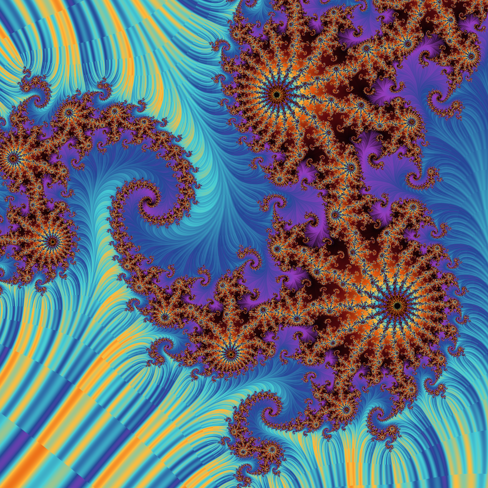
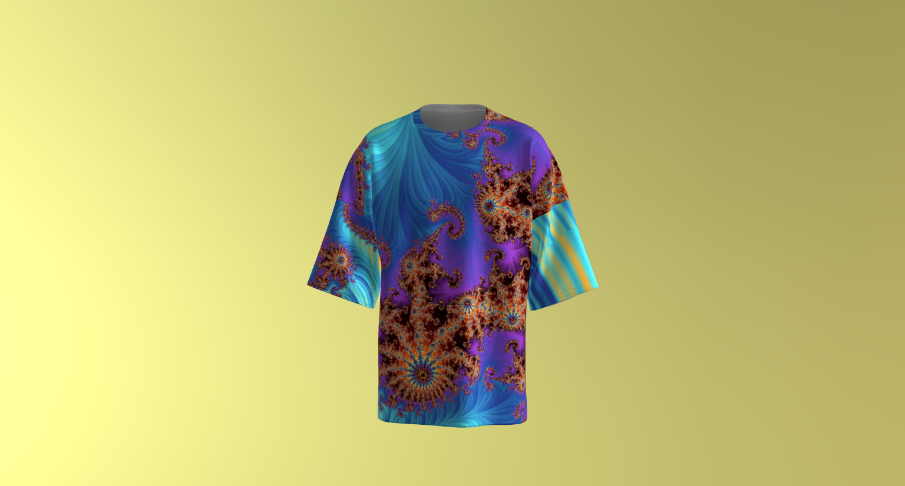
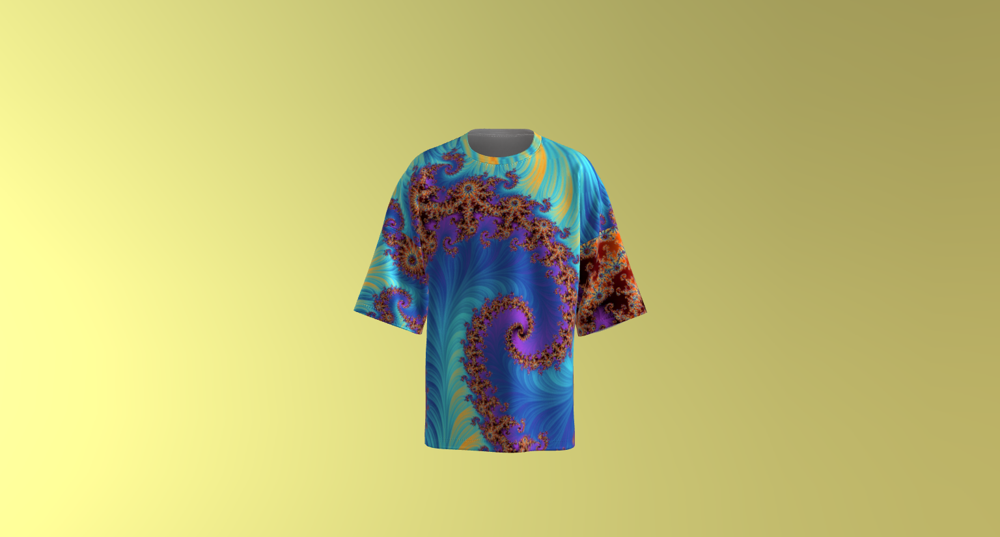

# Spiral Fractal Explorer
An interactive fractal visualization created using JavaScript and HTML Canvas. The project explores the Mandelbrot Set and Julia Set with custom colors, spiral presets, zooming, panning, and animation.

# Student Information
Name: Eiman Fatima \
Id 543105 \
Class: BSCS-15-D \
AI Lab 01 \


## Fractal Design



# Project Details
The project is based on the Mandelbrot Set and Julia Sets, which are
generated by repeatedly applying the complex quadratic function:

[ z_{n+1}=z_n^2+c ]

For the Mandelbrot Set, the starting value is (z_0=0) and the complex
value (c) changes according to the position of each pixel.

For the Julia Set, the pixel provides the starting value (z_0), while
(c) remains fixed.

The renderer checks how quickly each point escapes a chosen radius. The
resulting iteration value is then mapped to a controlled color palette
to create the detailed spiral and filament-like structures visible in
the final artwork.

## T-Shirt Design

### Front



### Back



## Demo Video

[](https://www.youtube.com/watch?v=IESAdGpCqck)

**YouTube:** https://www.youtube.com/watch?v=IESAdGpCqck

## Fractal Type

- Mandelbrot Set
- Julia Set

## Tools & Technologies

- HTML5
- CSS3
- JavaScript
- HTML Canvas

## Features

- Interactive Mandelbrot and Julia fractals
- Multiple spiral presets
- Custom color palettes
- Zoom and pan
- Randomized fractal variations
- High-resolution PNG export
- Animated color effects

## How to Run

1. Clone or download this repository.
2. Open `index.html` in a web browser.
3. Select a fractal and explore using the controls.

## Repository Structure

```text
spiral-fractal-explorer/
├── index.html
├── README.md
└── assets/
    ├── fractal.png
    ├── tshirt-front.png
    └── tshirt-back.png
```

## Submission Checklist

- [ ] Public GitHub repository
- [ ] README completed
- [ ] Fractal screenshot added
- [ ] T-shirt images added
- [ ] YouTube demo uploaded (≤ 1 minute)
- [ ] YouTube description includes GitHub link and student details
- [ ] YouTube link submitted on LMS

